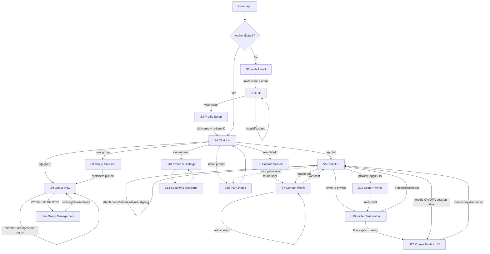

# UX Flows

User stories and screen-transition map for OpenGlass MVP. This document
defines **behavior and navigation only** — no visual design. It is the
contract between product intent and implementation: every arrow is a
navigation event, every screen lists the data it needs.

## Screen Inventory

| ID | Screen | Layer |
|----|--------|-------|
| S1 | Invite / email entry | Public |
| S2 | OTP verification | Public |
| S3 | Profile setup (nickname, ID) | Public |
| S4 | Chat list (empty / populated) | Public |
| S5 | Chat view (1-1) | Public |
| S6 | Contact search & add | Public |
| S7 | Contact profile / chat actions | Public |
| S8 | Group creation | Public |
| S9 | Group view | Public |
| S9a | Group management (owner panel) | Public |
| S10 | Private session invite (in-chat card) | Private |
| S11 | Private session setup + mutual verify | Private |
| S11b | Device-pair verification ritual (emoji grid / QR) | Private |
| S12 | Chat view in PRIVATE MODE (same window, private messages styled dark/muted with lock icon, dark header w/ countdown + BURN) | Private |
| S13 | Profile & settings | Public |
| S14 | Security & sessions | Public |
| S15 | PWA install / push / offline | Public |

## Flow Map

## Flow 1 — Onboarding

**US-1.1** As an invited user, I want to enter my invite code and email, so
that I can request access to the closed instance.

**US-1.2** As a user, I want to verify a one-time code sent to my email, so
that the server confirms I own the address.

**US-1.3** As a new user, I want to pick a nickname and receive a unique
tag number (`nickname#NNNN`), so that others can find me.

**Identity scheme**: two separate identifiers.

- **Display name** — free-form, changeable anytime, NOT unique (two
  users named "jojou" is fine). Purely cosmetic.
- **Tag `name#NNNN`** — unique handle bound at registration, immutable.
  Its prefix is taken from the display name chosen at registration but
  lives independently afterward. Tag uniqueness enforced: if `jojou` is
  taken, registration suggests a free variant (`Jojou13245`). `#1` is
  reserved for the instance owner (the hoster) and can never be
  reissued — admin impersonation impossible.

**Transitions**
- `S1 → S2`: submit invite + email → server sends OTP
- `S2 → S3`: valid OTP
- `S2 → S2`: invalid/expired code → error state, resend with cooldown
- `S3 → S4`: profile saved → land on empty chat list

**Edge cases**
- Invite code invalid → inline error on S1, no OTP sent
- OTP expired → resend button (cooldown 60s)
- Nickname taken → suggest alternatives, keep ID immutable

## Flow 2 — Contacts

**US-2.1** As a user, I want to search people by nickname or ID, so that I
can find contacts without sharing phone numbers.

**US-2.2** As a user, I want to add a found user to contacts, so that they
appear in my contact list.

**US-2.3** As a user, I want to open a chat directly from a contact profile.

**US-2.4** As a user, I want to report a user from their profile, so that
abuse can be flagged to the instance owner.

**US-2.5** As a user, I want to verify a contact's identity (emoji grid /
QR) right from their profile — without starting a private session — so
that the private toggle is unlocked in advance. Verified contacts show
a "verified" mark on profile and in chat.

**US-2.6** As a user, I want an optional verification freshness reminder:
if a contact was last verified more than N days ago (default 90,
configurable/off in settings), show a soft banner suggesting to
re-verify at the next opportunity. Non-blocking.

**Transitions**
- `S4 → S6`: search field / "add contact" action
- `S6 → S7`: select a result → contact profile card
- `S7 → S5`: "message" → creates/opens 1-1 chat

**Edge cases**
- User not found → empty result state with "check the ID" hint
- Already in contacts → profile shows "in contacts" state
- Blocked user → no profile actions (post-MVP block feature)

## Flow 2.5 — Chat List Features (S4)

**US-2.5.1** As a user, I want to pin important chats to the top of the
list, so that key conversations are always reachable.

**US-2.5.2** As a user, I want to mute a chat and see a mute icon on its
list item, so that I control noise per conversation.

**US-2.5.3** As a user, I want a "Saved Messages" self-chat pinned at the
top, so that I have a private scratch space for notes and drafts.

**US-2.5.4** As a user, I want folder tabs (All / custom folders) above
the chat list, so that I can group conversations.

**US-2.5.5** As a user, I want folder/group tags shown as chips under a
contact's name (in list and profile), so that I can see which folders or
groups a contact belongs to.

**Data**: `chat.pinned`, `chat.muted`, `chat.folder_ids[]`,
`contact.folder_tags[]`, `saved_messages` (self-chat type)

## Flow 3 — Public 1-1 Chat

**US-3.1** As a user, I want to send text and attachments, so that I can
communicate normally.

**US-3.2** As a user, I want to edit and delete my messages, so that I can
fix mistakes.

**US-3.3** As a user, I want to see read receipts and typing indicators, so
that I know the conversation state.

**US-3.4** As a user, I want to see the contact's presence (online/last
seen) in the chat header.

**US-3.5** As a user, I want to pin a message inside a chat and see a
pinned bar at the top, so that key info stays visible.

**US-3.6** As a user, I want to search within a chat's history, so that
I can find an old message without scrolling.

**US-3.7** As a user, I want a context menu on long-press on a message
(reply / copy / edit / pin / delete; 🔥 burn in private mode), so that
message actions are one gesture away.

**Message anatomy**: read receipt `✓✓` bottom-right inside own bubble;
timestamp beside it; date separators ("September 14") between groups;
burn `🔥` top-left on private bubbles — a single tap only shows the
"hold to burn" hint; the burn itself requires a long-press of 1–2 s
with a progress ring.

**Data needed per message**: `id, sender_id, text, attachments[],
created_at, edited_at, read_at, pinned`

**Edge cases**
- Send while offline → queue locally, send on reconnect, "sending" state
- Attachment too large → inline error with limit
- Peer typing → indicator in header, clears after timeout

## Flow 4 — Groups (party/raid model)

**US-4.1** As a user, I want to create a group and become its owner, so
that I can host a closed discussion.

**US-4.2** As an owner, I want to add/remove members and delegate specific
rights (invite, pin, manage messages), so that I control the group without
micromanaging.

**US-4.3** As a member, I want the UI to reflect my rights — disabled
actions are hidden or explained, not silently failing.

**Transitions**
- `S4 → S8 → S9`: create → pick members → group view
- `S9` owner panel: member list, per-member rights toggles

**Edge cases**
- Owner leaves → ownership transfer prompt or group dissolution (decide:
  transfer to oldest member — simpler, matches party model)
- Member without post rights → read-only view with explanation

## Flow 5 — Private Session (mode-toggle model)

**Core concept**: a private session is NOT a separate chat window — it is
a **mode of the existing 1-1 conversation**. A privacy toggle in the chat
header switches the conversation between public and private mode. Private
messages render inline in the same timeline, visually distinct (dark
muted bubbles + lock icon), and burn without leaving the window.

**US-5.1** As a user in a 1-1 chat, I want to flip a privacy toggle, so
that I can start exchanging sensitive data without leaving the
conversation.

**US-5.2** As the invited user, I want to accept or decline the invite
inside the same chat, so that I control when the mode activates.

**US-5.3** As the inviter, I want to set session lifetime (1 min–24 h,
default 10 min, remember last choice) in a modal before the session
starts.

**US-5.3b** As a participant, I want a flame (burn) icon on every private
message, so that I can destroy individual messages manually — full
point-level control instead of a session-wide flag.

**US-5.3a** As BOTH participants, I want verification to follow a
per-device TOFU (trust-on-first-use) model:

- **Verification binds device pairs, not accounts.** My iOS↔friend's
  iOS verified ≠ my desktop↔friend's iOS verified. A private session
  exists only between two specific devices — never shared account-wide.
- **First contact between a device pair** requires manual
  verification — emoji grid ritual or QR. Hoster-signed alone is NOT
  sufficient for a never-verified pair.
- **Chain of trust for new devices**: once one device pair is
  verified, a new device is verified through the existing private
  channel — the peer reads their emoji grid and I confirm it via the
  already-verified session. No call or meeting needed.
- **Key pinning**: after verification the peer device's identity key is
  pinned locally. Subsequent sessions on the same pair use
  hoster-signed verification automatically.
- **Key change detection**: a changed pinned key → prominent in-chat
  "identity key changed" banner → re-verification required before the
  private toggle unlocks.
- **No key backup**: private identity keys never leave the device —
  lost device = lost keys = re-verify.

| Method | Protection tier | When |
|--------|----------------|------|
| Emoji grid ritual | "Extra check" — mutual 5-emoji grid, both tap 3 | First session on a device pair; re-verify after key change; new device via existing private channel |
| QR code | "Maximum — verify in person" | Face-to-face anchor; paranoid mode |
| Hoster-signed identity keys | "Verified by instance" — automatic | Only for previously verified device pairs (pinned keys) |

**Trust indicators**: contacts and chats show a binary verification
chip — `unverified` (no pinned key or key changed) / `verified`
(key pinned, matches). Device details surface on tap ("verified:
my iOS ↔ their iOS · my desktop: unverified"), keeping the chip clean.

**US-5.3c** As a participant, I want session setup and verification to
appear as an in-chat system card (not a modal), so that the flow stays
inside the conversation timeline — same visual language as invite cards
and session markers.

**US-5.4** As a participant, I want an unmistakable private-mode
indicator: dark header with countdown + lock, muted message styling,
and a BURN action — so that I can never mistake which mode I'm in.

**US-5.5** As a participant, I want to toggle private mode OFF and back
ON while the session is alive (lifetime not expired, not burned), so
that I can mix public and private messages in one conversation.

**Transitions**
- `S5 (toggle ON) → S11`: setup modal — lifetime only
- `S11 → verify screen`: mutual fingerprint check, both sides
- `S11 → S10`: partner sees invite card in chat → accept/decline
- `S10 accept → verify` for invitee → both toggles ON
- `private mode ON → S12 state`: dark header, countdown, BURN, private
  messages inline (dark bubbles + lock)
- `toggle OFF (session alive)`: back to public mode, private history
  stays visible until burn/expiry
- `burn / expiry / grace exceeded`: private messages destroyed, toggle
  dies, timeline shows system marker "private session ended"

**Edge cases**
- Invitee offline → invite expires after configured timeout
- Disconnect mid-session → 60 s grace, visible "waiting" state → auto-burn
- App killed → same as disconnect; no session restore (zero persistence)
- Mode-confusion guard: private mode must be visually unmistakable —
  dark header, lock icon on every private bubble, changed composer
  placeholder ("Ephemeral message…")

## Flow 6 — Profile & Settings

**US-6.1** As a user, I want to edit my nickname and see my ID, so that I
control my identity.

**US-6.2** As a user, I want to manage active sessions/devices, so that I
can revoke stolen access.

**US-6.3** As a user, I want notification controls (push on/off,
per-chat mute), so that I control interruptions.

**US-6.4** As a user, I want to see the platform security tier of my
current device, so that I understand my local protection level.

**Transitions**
- `S4 → S13 → S14` and back
- `S14`: session list → revoke → confirmation → session killed

## Flow 7 — PWA Specifics

**US-7.1** As a PWA user, I want an install prompt at the right moment
(after first chat sent, not on landing), so that I install when value is
proven.

**US-7.2** As a PWA user, I want a push-permission request tied to context
("get notified about new messages"), not a cold browser prompt.

**US-7.3** As a PWA user, I want a visible offline state — queued messages,
greyed composer for unsupported actions — so that connectivity loss is not
silent.

**Edge cases**
- Push denied → in-app fallback hint in settings
- Offline on launch → cached chat list, no chat content guaranteed

## Cross-Cutting Rules

1. Every destructive action (delete message, remove member, burn session,
   revoke device) requires explicit confirmation.
2. Private-layer UI never appears in PWA — the module is not loaded.
3. Presence/typing must degrade gracefully when Redis is unavailable.
4. All flows must work fully keyboard-accessible (native shells later).
5. Empty states are designed states, not afterthoughts: every list has a
   defined empty view.

## Recorded Product Decisions

- **Invite issuance**: no in-app UI. The hoster generates invite codes via
  a CLI script shipped with the instance (`POST /admin/invites`, local
  only). Fits the ~100-user closed-instance scope; revisit if instances
  grow.
- **Push payload privacy**: notifications carry no message content —
  "New message" + sender display name at most. Private sessions never
  trigger push (relay-only, no server-readable content anyway).
- **Dark theme**: deferred post-MVP. Dark surfaces are reserved for the
  private layer as a mode-confusion guard; a general dark theme would
  weaken that signal. Tokens are structured so a `.theme-dark` can be
  added later without refactoring.
- **Fonts**: Source Code Pro is self-hosted (`docs/ux/fonts/`, OFL).
  No third-party font CDN anywhere in the app.
- **Verification ritual placement**: S11b is reachable both inside the
  session-setup flow and standalone from S7 contact profile (US-2.5).
