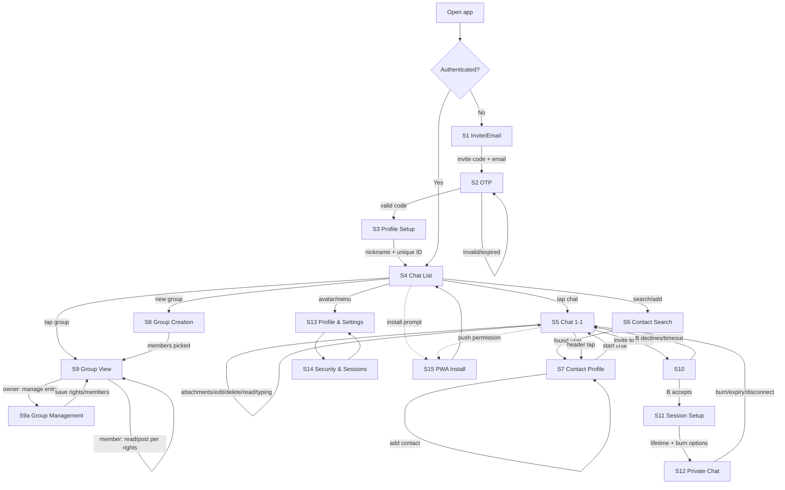

# UX Flows

User stories and screen-transition map for OpenGlass MVP. This document
defines **behavior and navigation only** — no visual design. It is the
contract between product intent and implementation: every arrow is a
navigation event, every screen lists the data it needs.

## Screen Inventory

| ID | Screen | Layer |
|----|--------|-------|
| S1 | Invite / email entry | Public |
| S2 | OTP verification | Public |
| S3 | Profile setup (nickname, ID) | Public |
| S4 | Chat list (empty / populated) | Public |
| S5 | Chat view (1-1) | Public |
| S6 | Contact search & add | Public |
| S7 | Contact profile / chat actions | Public |
| S8 | Group creation | Public |
| S9 | Group view | Public |
| S9a | Group management (owner panel) | Public |
| S10 | Private session invite (in-chat) | Private |
| S11 | Private session setup | Private |
| S12 | Private chat window | Private |
| S13 | Profile & settings | Public |
| S14 | Security & sessions | Public |
| S15 | PWA install / push / offline | Public |

## Flow Map

## Flow 1 — Onboarding

**US-1.1** As an invited user, I want to enter my invite code and email, so
that I can request access to the closed instance.

**US-1.2** As a user, I want to verify a one-time code sent to my email, so
that the server confirms I own the address.

**US-1.3** As a new user, I want to pick a nickname and receive a unique
tag number (`nickname#NNNN`), so that others can find me.

**Identity scheme**: every user gets `nickname#number`. `#1` is reserved
for the instance owner (the hoster — first registered user) and can never
be reissued, making admin impersonation impossible. Numbers are sequential
per instance.

**Transitions**
- `S1 → S2`: submit invite + email → server sends OTP
- `S2 → S3`: valid OTP
- `S2 → S2`: invalid/expired code → error state, resend with cooldown
- `S3 → S4`: profile saved → land on empty chat list

**Edge cases**
- Invite code invalid → inline error on S1, no OTP sent
- OTP expired → resend button (cooldown 60s)
- Nickname taken → suggest alternatives, keep ID immutable

## Flow 2 — Contacts

**US-2.1** As a user, I want to search people by nickname or ID, so that I
can find contacts without sharing phone numbers.

**US-2.2** As a user, I want to add a found user to contacts, so that they
appear in my contact list.

**US-2.3** As a user, I want to open a chat directly from a contact profile.

**US-2.4** As a user, I want to report a user from their profile, so that
abuse can be flagged to the instance owner.

**Transitions**
- `S4 → S6`: search field / "add contact" action
- `S6 → S7`: select a result → contact profile card
- `S7 → S5`: "message" → creates/opens 1-1 chat

**Edge cases**
- User not found → empty result state with "check the ID" hint
- Already in contacts → profile shows "in contacts" state
- Blocked user → no profile actions (post-MVP block feature)

## Flow 3 — Public 1-1 Chat

**US-3.1** As a user, I want to send text and attachments, so that I can
communicate normally.

**US-3.2** As a user, I want to edit and delete my messages, so that I can
fix mistakes.

**US-3.3** As a user, I want to see read receipts and typing indicators, so
that I know the conversation state.

**US-3.4** As a user, I want to see the contact's presence (online/last
seen) in the chat header.

**Data needed per message**: `id, sender_id, text, attachments[],
created_at, edited_at, read_at`

**Edge cases**
- Send while offline → queue locally, send on reconnect, "sending" state
- Attachment too large → inline error with limit
- Peer typing → indicator in header, clears after timeout

## Flow 4 — Groups (party/raid model)

**US-4.1** As a user, I want to create a group and become its owner, so
that I can host a closed discussion.

**US-4.2** As an owner, I want to add/remove members and delegate specific
rights (invite, pin, manage messages), so that I control the group without
micromanaging.

**US-4.3** As a member, I want the UI to reflect my rights — disabled
actions are hidden or explained, not silently failing.

**Transitions**
- `S4 → S8 → S9`: create → pick members → group view
- `S9` owner panel: member list, per-member rights toggles

**Edge cases**
- Owner leaves → ownership transfer prompt or group dissolution (decide:
  transfer to oldest member — simpler, matches party model)
- Member without post rights → read-only view with explanation

## Flow 5 — Private Session

**US-5.1** As a user in a 1-1 chat, I want to invite the contact to a
private session, so that we can exchange sensitive data.

**US-5.2** As the invited user, I want to accept or decline the invite
inside the public chat, so that I control when sessions start.

**US-5.3** As the inviter, I want to set session lifetime (1 min–24 h,
default 10 min, remember last choice) and per-message burn, so that the
session matches the sensitivity level.

**US-5.3a** As BOTH participants, I want to see and verify the session
fingerprint before the session starts, so that neither side can be
MITM'd — verification is mutual, not inviter-only.

**US-5.4** As a participant, I want to see the countdown, the partner's
connection state, and a fingerprint I can verify, so that I trust the
channel.

**US-5.5** As a participant, I want a burn action that destroys the session
immediately for both sides.

**Transitions**
- `S5 → S10`: invite appears as an in-chat card
- `S10 → S11`: accept → setup (inviter configures; invitee sees summary)
- `S10 → S5`: decline or timeout → card shows "declined/expired"
- `S11 → S12`: both confirmed → private window opens
- `S12 → S5`: burn / lifetime expiry / disconnect grace exceeded → return
  to public chat, session content gone

**Edge cases**
- Invitee offline → invite expires after configured timeout
- Disconnect mid-session → 60 s grace with visible "waiting" state, then
  auto-burn
- App killed → same as disconnect; no session restore (zero persistence)

## Flow 6 — Profile & Settings

**US-6.1** As a user, I want to edit my nickname and see my ID, so that I
control my identity.

**US-6.2** As a user, I want to manage active sessions/devices, so that I
can revoke stolen access.

**US-6.3** As a user, I want notification controls (push on/off,
per-chat mute), so that I control interruptions.

**US-6.4** As a user, I want to see the platform security tier of my
current device, so that I understand my local protection level.

**Transitions**
- `S4 → S13 → S14` and back
- `S14`: session list → revoke → confirmation → session killed

## Flow 7 — PWA Specifics

**US-7.1** As a PWA user, I want an install prompt at the right moment
(after first chat sent, not on landing), so that I install when value is
proven.

**US-7.2** As a PWA user, I want a push-permission request tied to context
("get notified about new messages"), not a cold browser prompt.

**US-7.3** As a PWA user, I want a visible offline state — queued messages,
greyed composer for unsupported actions — so that connectivity loss is not
silent.

**Edge cases**
- Push denied → in-app fallback hint in settings
- Offline on launch → cached chat list, no chat content guaranteed

## Cross-Cutting Rules

1. Every destructive action (delete message, remove member, burn session,
   revoke device) requires explicit confirmation.
2. Private-layer UI never appears in PWA — the module is not loaded.
3. Presence/typing must degrade gracefully when Redis is unavailable.
4. All flows must work fully keyboard-accessible (native shells later).
5. Empty states are designed states, not afterthoughts: every list has a
   defined empty view.
